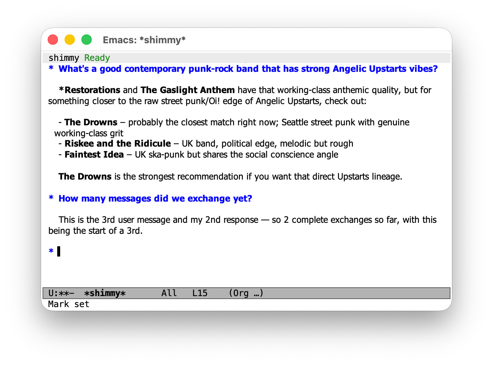
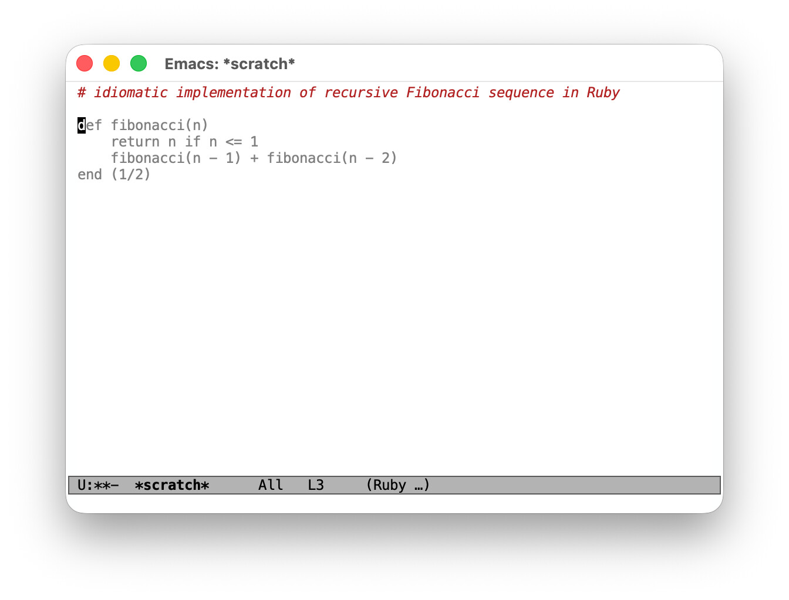
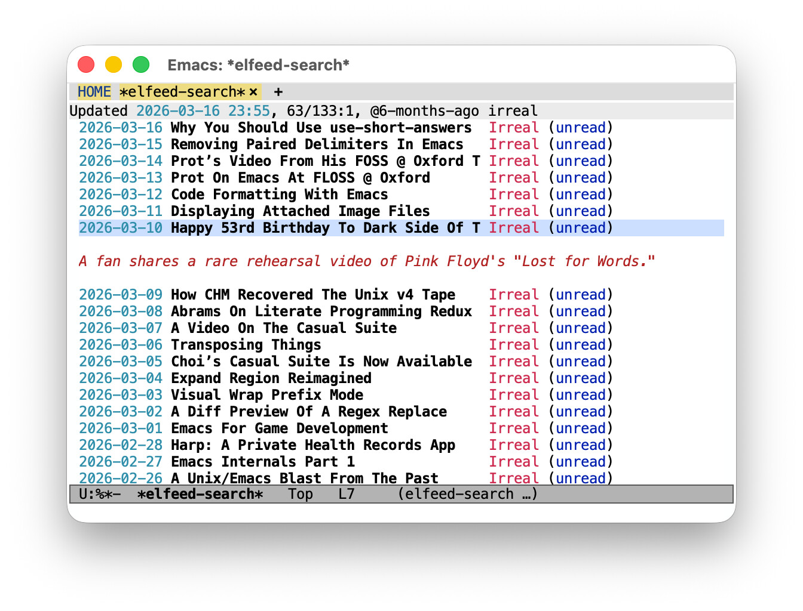

#+title: ~acp2ollama~ in Emacs for fun and profit
#+date: [2026-03-19 Thu]
#+description: A hands-on look at using acp2ollama to connect ACP agents to Emacs packages that speak the Ollama API — with results ranging from 'works great' to 'probably don't bother.'
#+filetags: emacs

#+html_head_extra: <meta name="twitter:card" content="summary">
#+html_head_extra: <meta name="twitter:description" content="A hands-on look at using acp2ollama to connect ACP agents to Emacs packages that speak the Ollama API — with results ranging from 'works great' to 'probably don't bother.'">
#+html_head_extra: <meta name="twitter:image" content="https://fritzgrabo.com/posts/acp2ollama-in-emacs-for-fun-and-profit/og-image.jpeg">
#+html_head_extra: <meta name="twitter:site" content="@fritzgrabo">
#+html_head_extra: <meta name="twitter:title" content="acp2ollama in Emacs for fun and profit">
#+html_head_extra: <meta property="og:description" content="A hands-on look at using acp2ollama to connect ACP agents to Emacs packages that speak the Ollama API — with results ranging from 'works great' to 'probably don't bother.'">
#+html_head_extra: <meta property="og:image" content="https://fritzgrabo.com/posts/acp2ollama-in-emacs-for-fun-and-profit/og-image.jpeg">
#+html_head_extra: <meta property="og:title" content="acp2ollama in Emacs for fun and profit">

I recently published [[https://github.com/fritzgrabo/acp2ollama][~acp2ollama~]], a command-line tool that wraps an [[https://agentclientprotocol.com/][ACP]] agent and exposes it as an [[https://docs.ollama.com/api/introduction][Ollama]]-compatible HTTP server, so any tool that speaks the Ollama API can talk to the agent instead.

This post shows what that looks like in practice in Emacs, where a healthy ecosystem of AI-powered packages supports the Ollama API out of the box.
The results are mixed, and the rest of this post picks examples across the spectrum to illustrate.

* What ~acp2ollama~ does (and doesn't do)

Two fundamental architectural mismatches are worth understanding before we start, because they shape what works well and what doesn't.

*Stateful vs. stateless.*
The Ollama API is stateless: clients resend the full message history on every request.
ACP agents are stateful: they accumulate context across turns and only receive new messages.
~acp2ollama~ bridges this with a pool of long-lived ACP sessions.
Spawning a new agent session is slow so it pre-warms sessions in the background to ensure new conversations can start immediately.
It also fingerprints incoming message histories to match continuation requests to the session that already holds the right context, so only new messages are forwarded to the agent.

*Tool use.*
Ollama clients declare available tools in the request and expect the model to ask the client to call them.
ACP agents ship with their own tools and execute them autonomously.
~acp2ollama~ silently ignores incoming tool declarations and never asks to execute tools on the client side.
Use ~--session-mode~ to pre-approve operations your agent needs; without it, all permission requests are denied and the agent can't do anything that requires approval.

With that out of the way, let's set everything up so we can take it for a spin!

* Setup

Build ~acp2ollama~ from source (requires Go 1.24+):

#+begin_src shell
git clone https://github.com/fritzgrabo/acp2ollama
cd acp2ollama

go build -o acp2ollama .
#+end_src

Run ~acp2ollama --help~ to see all available options and their defaults.
There are quite a few knobs to tweak: pool sizes, warmup counts, session TTLs, and more.
Getting them right for your specific use case can make a real difference in responsiveness.

For this post, I'll use a fictional ACP agent called ~shimmy~, started with the command ~shimmy-acp~.
Make sure to check your own agent's terms of service before connecting it to a third-party client.

Let's start the server, pointing at our ACP agent:

#+begin_src shell
acp2ollama -- shimmy-acp
#+end_src

This binds to port ~11434~ by default, so any Ollama client pointing at ~localhost~ will find it without further configuration.

Before setting up the Emacs packages below, find out which models your agent provides:
run it directly once, or just start ~acp2ollama~ with ~--log-level~ debug and check the output: it prints the available models when it pre-warms its first session.
You'll need a valid model name in each of the package configurations that follow.

* Works well: chatting in ~gptel~

There's a host of packages in Emacs that allows for chatting with LLMs in distinct conversation buffers.
Check out [[https://github.com/xenodium/chatgpt-shell][~chatgpt-shell~]] for a package that's dedicated to this usecase, or [[https://github.com/karthinks/gptel][~gptel~]] or [[https://github.com/captainflasmr/ollama-buddy][~ollama-buddy~]] for packages that offer a more generic integration.

Let's give ~gptel~ a whirl; connecting it to ~acp2ollama~ is straightforward:

#+begin_src emacs-lisp
(use-package gptel
  :ensure
  :config
  (gptel-make-ollama "shimmy"
    :host "localhost:11434"
    :models '(shimmy)
    :stream t))
#+end_src

Set this as your default backend and model, or select it interactively with ~M-x gptel-menu~.

Because ~acp2ollama~ maintains stateful sessions, multi-turn conversations in ~gptel~'s chat buffers work as you'd expect: context accumulates across turns, and the agent behaves like it does in its native interface.
Response times are reasonable too, since sessions are reused rather than spawned fresh on every request.

#+caption: A gptel session buffer showing a conversation with shimmy
#+attr_html: :alt  A gptel session buffer showing a conversation with shimmy

* Barely works: completion with ~minuet-ai~

[[https://github.com/milanglacier/minuet-ai][~minuet-ai~]] provides AI-powered code completion in Emacs.
It supports Ollama, so connecting it to ~acp2ollama~ is possible.
The caveats apply in full here, and the result is instructive.

ACP agents are conversational tools, not completion engines.
They're not optimized for the fill-in-the-middle task that code completion requires, and they're slow: where a dedicated completion model might respond in milliseconds, an ACP agent takes seconds.
With ~minuet-ai~'s default setting of triggering frequently, the experience is not usable.

The basic setup uses ~minuet-ai~'s ~openai-fim-compatible~ provider, which maps to ~acp2ollama~'s ~/v1/completions~ endpoint and returns multiple completion candidates in a single call.
The trick that makes it barely usable is to disable automatic triggering entirely, so completions are only requested when you explicitly ask for them:

#+begin_src emacs-lisp
(use-package minuet
  :ensure
  :config
  (setq minuet-provider 'openai-fim-compatible)
  (plist-put minuet-openai-fim-compatible-options :end-point "http://localhost:11434/v1/completions")
  (plist-put minuet-openai-fim-compatible-options :model "shimmy")
  (plist-put minuet-openai-fim-compatible-options :name "shimmy")
  (plist-put minuet-openai-fim-compatible-options :api-key "TERM")

  ;; Disable automatic triggering; use manual completion only.
  (setq minuet-auto-suggestion-debounce-delay nil)
  (define-key minuet-mode-map (kbd "M-TAB") #'minuet-show-suggestion))
#+end_src

With manual triggering, the agent's response time is noticeable, but not disruptive.
In practice, though, you'd rather have the right tool.
ACP agents are a poor fit for latency-sensitive, high-frequency tasks.

#+caption: A scratch buffer showing auto-completions via minuet-ai
#+attr_html: :alt  A scratch buffer showing auto-completions via minuet-ai

* Works, but probably overkill: ~elfeed-summarize~

[[https://github.com/fritzgrabo/elfeed-summarize][~elfeed-summarize~]] adds LLM-powered summaries to [[https://github.com/skeeto/elfeed][elfeed]], the extensible Emacs RSS reader: a low-frequency, latency-tolerant task, which makes it a reasonable fit for ~acp2ollama~.

The package is built on Andrew Hyatt's [[https://github.com/ahyatt/llm][~llm~]] library, which provides a unified interface to LLM providers, including Ollama.
Connecting is a matter of pointing the ~llm-ollama~ provider at the right host and model:

#+begin_src emacs-lisp
(use-package elfeed-summarize
  :ensure
  :after elfeed
  :config
  (setq elfeed-summarize-llm-provider
        (make-llm-ollama
          :host "localhost"
          :port 11434
          :chat-model "shimmy"))
  (elfeed-summarize-mode 1))
#+end_src

The setup works without complaint, and the summaries are good.
That said, summarizing RSS entries is a simple task, handled just as well by a local model like ~llama3~ running in a real Ollama instance.
Routing it through ~shimmy~ gets the job done, but it's a lot of horsepower for something a lightweight local model does quietly in the background.

#+caption: An elfeed buffer showing a summary of an RSS item generated via elfeed-summarize
#+attr_html: :alt  An elfeed buffer showing a summary of an RSS item generated via elfeed-summarize

The pattern shown above applies to the many other Emacs packages built on ~llm~: [[https://github.com/s-kostyaev/ellama][ellama]], [[https://github.com/douo/magit-gptcommit][magit-gptcommit]], [[https://github.com/ahyatt/ekg/][ekg]] and others.
If a package exposes an ~llm~-compatible provider setting, swapping in ~make-llm-ollama~ pointed at ~acp2ollama~ is all it takes.
For simple tasks, though, it's worth asking whether a local model might serve just as well.

* Closing thoughts

~acp2ollama~ is experimental, a proof of concept rather than a daily driver: the caveats in its README are real.

For conversational use cases in Emacs, it makes a surprising number of things work with very little configuration and, well, without burning through API tokens.

It's a fresh release and I plan to use it for a while to see what can be improved.
I'm curious to see what use cases others run into.

If you try it and have thoughts about what works, what doesn't, I'd love to [[mailto:hello@fritzgrabo.com][hear from you]].
