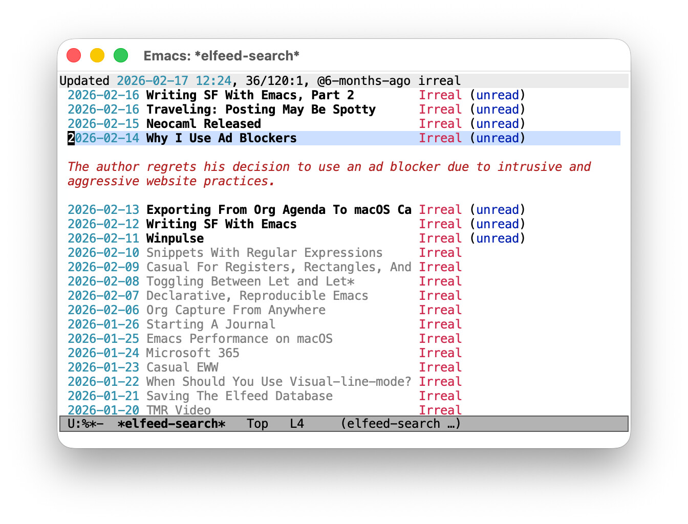

#+title: Introducing ~elfeed-summarize~
#+date: [2026-02-19 Thu]
#+filetags: emacs

#+html_head_extra: <meta name="twitter:card" content="summary">
#+html_head_extra: <meta name="twitter:description" content="Add LLM-powered inline summaries to elfeed.">
#+html_head_extra: <meta name="twitter:image" content="https://fritzgrabo.com/posts/introducing-elfeed-summarize/og-image.jpeg">
#+html_head_extra: <meta name="twitter:site" content="@fritzgrabo">
#+html_head_extra: <meta name="twitter:title" content="Introducing elfeed-summarize">
#+html_head_extra: <meta property="og:description" content="Add LLM-powered inline summaries to elfeed.">
#+html_head_extra: <meta property="og:image" content="https://fritzgrabo.com/posts/introducing-elfeed-summarize/og-image.jpeg">
#+html_head_extra: <meta property="og:title" content="Introducing elfeed-summarize">

* On consuming vs. generating

As I worked on my [[../how-i-talk-to-books-and-source-code/][previous post]] about a Claude Code skill for interactive training sessions, I got introduced to a thought that stuck with me:
the secret super power of large language models isn't generating content, it's consuming it.
Writing an essay, drafting code, those are the applications that get most of the attention (and skepticism).
But asking a model to dive deep into a book, a code base, etc., then answer questions about it?
That's quieter, more reliable, and surprisingly useful in practice.

This post is about one such use case: summarizing RSS entries to help decide whether I want to read them.

* The problem

I follow a lot of feeds, and I don't read everything.
Instead, I scan the headlines and decide what interests me.
Scanning efficiently requires that the headlines actually tell you something, and well, sometimes they don't.

Here are a few random recent examples from my feed:

- Is this a good sign?
- Deep blue
- Fragments: February 13

Opening an entry to find out is often self-defeating: at that point, you've already read parts of it.

* Enter ~elfeed-summarize~

I use the wonderful [[https://github.com/skeeto/elfeed][elfeed]] as a news reader: it's an extensible Emacs package that handles everything from fetching, storing, reading, tagging, to searching RSS feeds.

As it happens, the similarly wonderful [[https://github.com/ahyatt/llm][llm]] library provides a unified interface to LLM providers in Emacs; both local ones via Ollama and cloud services like OpenAI or Gemini.

Connecting the dots seemed straightforward enough, and just a couple of hours later, [[https://github.com/fritzgrabo/elfeed-summarize][~elfeed-summarize~]] adds LLM-powered summaries to elfeed.

Press ~z~ on any entry and a brief summary appears inline as an overlay below the headline in elfeed's "search" view, or as a ~Summary:~ header in its "show" view.
Press ~z~ again to hide it.

The entry's locally cached content is what gets summarized; no network request to the original article is needed.

#+caption: An elfeed search buffer; one of the entries displays a summary
#+attr_html: :alt  An elfeed search buffer; one of the entries displays a summary

The goal of a summary here is modest and specific: to help you decide whether an article is worth reading.
Not to replace reading it, not to give you a false sense of having read it. Just to answer the question "/should I open this?/" a little faster.

* Expanding incrementally

Sometimes, a single sentence isn't enough: press ~Z~ (capital Z) and the package generates an additional paragraph of detail.
Press it again for another.
Each expansion builds on what's already there, so you can dial in exactly as much context as you need before committing to the full article.

* Choosing a provider with ~llm~

For the use case of potentially summarizing many entries in a single sitting, a local model through [[https://ollama.com][Ollama]] is the natural choice.
It's free to run, it works offline, and your reading habits stay on your machine.
A complete setup using Mistral looks like this:

#+begin_src emacs-lisp
(use-package elfeed-summarize
  :ensure
  :after elfeed
  :config
  (setq elfeed-summarize-llm-provider
        (make-llm-ollama :chat-model "mistral:latest"))
  (elfeed-summarize-mode 1))
#+end_src

Of course, if you prefer a cloud provider like OpenAI, Gemini, Claude, or any other supported by ~llm~, the configuration is equally simple.

* Closing thoughts

None of this would exist without the work of others.
Christopher Wellons's [[https://github.com/skeeto/elfeed][elfeed]] is an excellent piece of software that makes extending it genuinely pleasant. Its architecture invites exactly this kind of addition.
Andrew Hyatt's [[https://github.com/ahyatt/llm][llm]] library saved me from writing provider-specific API calls and from committing to a single service.

Finally, if you try ~elfeed-summarize~ and have thoughts about what works, what doesn't, what you'd want to see, I'd love to [[mailto:hello@fritzgrabo.com][hear from you]]. Thanks!
